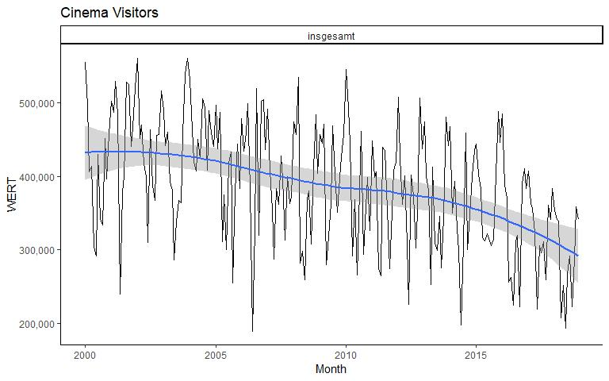
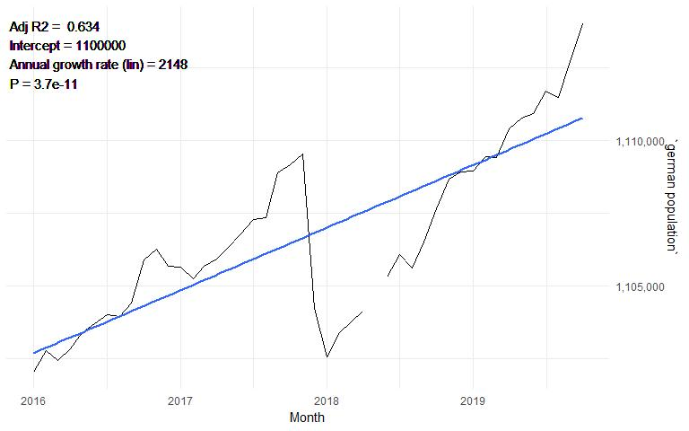
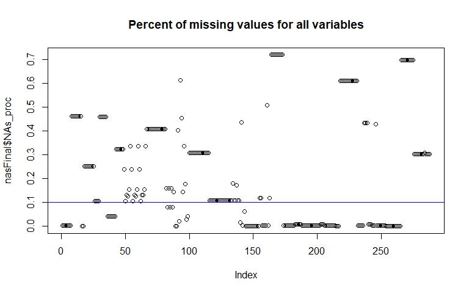
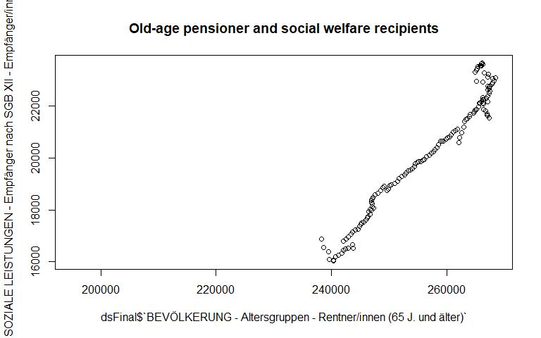
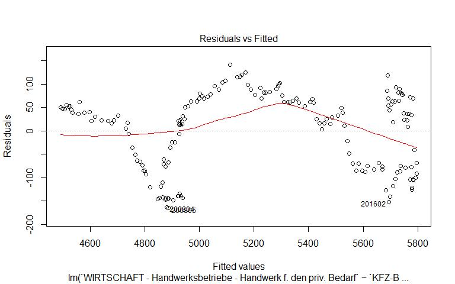
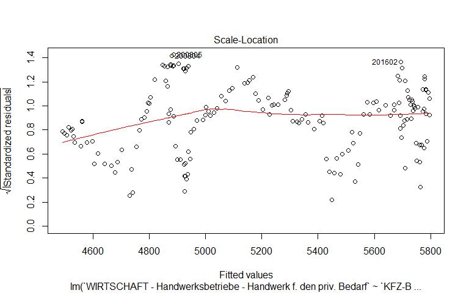

Munich in numbers
================
Calin
30 November, 2019

  - [Brief exploratory analysis](#brief-exploratory-analysis)
      - [Data](#data)
  - [General Trends (monthly)](#general-trends-monthly)
      - [Cinema visitors](#cinema-visitors)
      - [OlympiaPark & Zoo](#olympiapark-zoo)
      - [weather trends](#weather-trends)
      - [Tourists](#tourists)
      - [Population](#population)
      - [Religion](#religion)
      - [Construction](#construction)
      - [Unemployment (gender &
        nationality)](#unemployment-gender-nationality)
      - [Cars in Munich](#cars-in-munich)
  - [Counting NAs (missing data)](#counting-nas-missing-data)
  - [Explore correlations](#explore-correlations)
      - [simple use of cor()](#simple-use-of-cor)
      - [the correlate package](#the-correlate-package)
  - [Next steps](#next-steps)
      - [Highly Correlated variables](#highly-correlated-variables)
      - [linear models](#linear-models)

# Brief exploratory analysis

This is a brief EDA of Munich stats.

## Data

### source

Thanks to **Statistische Amt München** for making the data available on
a monthly basis. They make way more data available, these are solely
main KPIs. Source of data:
<http://www.mstatistik-muenchen.de/monatszahlenmonitoring/export/export.php>.
Official Data exploration portal:
<http://www.mstatistik-muenchen.de/monatszahlenmonitoring/atlas.html?indicator=i158&date=Jan&select=20,19&select2=JAHR&indicator2=i0>.
Data here is extracted from Excel, processed into data.frames and
correlation charts

### raw

The raw data is a list of data-frames

``` r
as.data.frame(lapply(dat, dim)) %>% 
  rownames_to_column() %>%
  kable()
```

<table>

<thead>

<tr>

<th style="text-align:left;">

rowname

</th>

<th style="text-align:right;">

INHALTSÜBERSICHT

</th>

<th style="text-align:right;">

ARBEITSMARKT

</th>

<th style="text-align:right;">

BAUEN

</th>

<th style="text-align:right;">

BEVÖLKERUNG

</th>

<th style="text-align:right;">

EINBÜRGERUNGEN

</th>

<th style="text-align:right;">

FEUERWEHR.MÜNCHEN

</th>

<th style="text-align:right;">

FLUGVERKEHR

</th>

<th style="text-align:right;">

FREIZEIT

</th>

<th style="text-align:right;">

KFZ.Bestand

</th>

<th style="text-align:right;">

KFZ.Neuzulassungen

</th>

<th style="text-align:right;">

KINOS

</th>

<th style="text-align:right;">

MUSEEN

</th>

<th style="text-align:right;">

ORCHESTER

</th>

<th style="text-align:right;">

SOZIALE.LEISTUNGEN

</th>

<th style="text-align:right;">

THEATER

</th>

<th style="text-align:right;">

TOURISMUS

</th>

<th style="text-align:right;">

VERKEHRSUNFÄLLE

</th>

<th style="text-align:right;">

WIRTSCHAFT

</th>

<th style="text-align:right;">

WITTERUNG

</th>

<th style="text-align:right;">

IMPRESSUM

</th>

</tr>

</thead>

<tbody>

<tr>

<td style="text-align:left;">

1

</td>

<td style="text-align:right;">

288

</td>

<td style="text-align:right;">

2158

</td>

<td style="text-align:right;">

720

</td>

<td style="text-align:right;">

19385

</td>

<td style="text-align:right;">

670

</td>

<td style="text-align:right;">

1932

</td>

<td style="text-align:right;">

1904

</td>

<td style="text-align:right;">

1666

</td>

<td style="text-align:right;">

5056

</td>

<td style="text-align:right;">

2640

</td>

<td style="text-align:right;">

228

</td>

<td style="text-align:right;">

2087

</td>

<td style="text-align:right;">

1428

</td>

<td style="text-align:right;">

2115

</td>

<td style="text-align:right;">

4098

</td>

<td style="text-align:right;">

966

</td>

<td style="text-align:right;">

1596

</td>

<td style="text-align:right;">

4550

</td>

<td style="text-align:right;">

1659

</td>

<td style="text-align:right;">

13

</td>

</tr>

<tr>

<td style="text-align:left;">

2

</td>

<td style="text-align:right;">

7

</td>

<td style="text-align:right;">

9

</td>

<td style="text-align:right;">

9

</td>

<td style="text-align:right;">

9

</td>

<td style="text-align:right;">

9

</td>

<td style="text-align:right;">

9

</td>

<td style="text-align:right;">

9

</td>

<td style="text-align:right;">

9

</td>

<td style="text-align:right;">

9

</td>

<td style="text-align:right;">

9

</td>

<td style="text-align:right;">

9

</td>

<td style="text-align:right;">

9

</td>

<td style="text-align:right;">

9

</td>

<td style="text-align:right;">

9

</td>

<td style="text-align:right;">

9

</td>

<td style="text-align:right;">

9

</td>

<td style="text-align:right;">

9

</td>

<td style="text-align:right;">

9

</td>

<td style="text-align:right;">

9

</td>

<td style="text-align:right;">

1

</td>

</tr>

</tbody>

</table>

### aggregated

We’ll now compress the **original disparated data** in one compact
data.frame For that, we create dynamic column names and aggregate the
monthly values The final result will be a large matrix (\~300 columns)
where each column represents a variable and the rows are the monthly
values (20 yrs x 12 months)

``` r
##########################
# looping through all the Excel sheets
dsFinal <- data.frame()
for (i in 1:length(names(dat))) {
  SECTIONNAME <- names(dat)[i]
  dtmp <- (dat[SECTIONNAME])[[1]]
  # if the current section has values in it
  if ('WERT' %in% names(dtmp)) {
    # creating dynamic column names and assign monthly values as cols
    dtmp_mo <- dtmp %>%
      select(MONATSZAHL, AUSPRAEGUNG, MONAT, WERT) %>%
      mutate(colname=paste(SECTIONNAME, MONATSZAHL, AUSPRAEGUNG, sep = " - ")) %>%
      select(MONAT, colname, WERT) %>%
      spread(MONAT, WERT) 
    rownames(dtmp_mo) <- dtmp_mo$colname
    dtmp_mo$colname <- NULL
    # transpose monthly values to rows
    dtmp_mo <- t(dtmp_mo)
    # back from tibble to dataframe
    dtmp_mo <-as.data.frame(dtmp_mo)
    dtmp_mo$month <- rownames(dtmp_mo)
    
    if (nrow(dsFinal)==0){
      # if the final construct doesn't exist, simply create it
      dsFinal <- dtmp_mo
    } else {
      # if we have values in it already, merge them (full join)  using the month column
      dsFinal <- dtmp_mo %>%
        full_join(dsFinal, by = "month")
    }
  }
}
# cleanup
rm(dtmp, dtmp_mo, i, SECTIONNAME)

rownames(dsFinal) <- dsFinal$month
dsFinal$month <- NULL
dim(dsFinal)
```

    ## [1] 238 288

``` r
# dsFinal[1:10,1:2] %>% kable()
# colMeans(dsFinal, na.rm = T) %>% kable()
# str(dsFinal)
##########################
```

# General Trends (monthly)

## Cinema visitors

``` r
##########################
# exploratory charts
dat$KINOS %>%
  mutate(Month = as.Date(paste0(MONAT,'01'), format = '%Y%m%d')) %>%
  ggplot(., aes(x=Month, y = WERT, group=AUSPRAEGUNG)) + 
    geom_line() + 
    facet_wrap(~AUSPRAEGUNG) +
    theme_classic()+ 
    geom_smooth() + scale_y_continuous(labels = scales::comma) + ggtitle("Cinema Visitors")
```

<!-- -->

## OlympiaPark & Zoo

``` r
dat$FREIZEIT %>%
  mutate(Month = as.Date(paste0(MONAT,'01'), format = '%Y%m%d')) %>%
  mutate(Year = substring(Month, 3, 4))  %>%
  group_by(Year, AUSPRAEGUNG) %>%
  summarize(Visitors = max(WERT, na.rm = T)) %>%
  ggplot(., aes(x=Year, y = Visitors, color=AUSPRAEGUNG, group=1)) + 
    geom_point() + 
    theme_classic()+ 
    scale_y_continuous(labels = scales::comma) + ggtitle("Leisure")
```

    ## Warning in max(WERT, na.rm = T): no non-missing arguments to max; returning
    ## -Inf
    
    ## Warning in max(WERT, na.rm = T): no non-missing arguments to max; returning
    ## -Inf

<!-- -->

## weather trends

### Sun & temperature

``` r
dat$WITTERUNG %>%
  filter(MONATSZAHL %in% c("Sonnenschein", "Lufttemperatur")) %>%
  mutate(Month = as.Date(paste0(MONAT,'01'), format = '%Y%m%d')) %>%
  ggplot(., aes(x=Month, y = WERT, group=AUSPRAEGUNG)) + 
  geom_line() + 
  facet_wrap(~AUSPRAEGUNG, scales = "free") +
  theme_classic()+ 
  geom_smooth() + scale_y_continuous(labels = scales::comma) + ggtitle("monthly weather trends")
```

<!-- -->

### Rain

``` r
dat$WITTERUNG %>%
  filter(MONATSZAHL %in% c("Niederschlag")) %>%
  mutate(Month = as.Date(paste0(MONAT,'01'), format = '%Y%m%d')) %>%
  ggplot(., aes(x=Month, y = WERT, group=AUSPRAEGUNG)) + 
  geom_line() + 
  facet_wrap(~AUSPRAEGUNG, scales = "free", nrow=2) +
  theme_classic()+ 
  geom_smooth() + scale_y_continuous(labels = scales::comma) + ggtitle("monthly weather trends")
```

<!-- -->

## Tourists

``` r
dat$TOURISMUS %>%
  filter(MONATSZAHL %in% c("Gäste")) %>%
  mutate(Month = as.Date(paste0(MONAT,'01'), format = '%Y%m%d')) %>%
  ggplot(., aes(x=Month, y = WERT, group=AUSPRAEGUNG)) + 
  geom_line() + 
  facet_wrap(~AUSPRAEGUNG, scales = "free", nrow=3) +
  theme_classic()+ 
  geom_smooth() + scale_y_continuous(position = "right", labels = scales::comma) + ggtitle("monthly trend - Turist guests")
```

<!-- -->

``` r
dsFinal$id <- 1:nrow(dsFinal)
lm.mod.tourists <- lm(`TOURISMUS - Gäste - Ausland` ~ id, data = dsFinal)
cat(paste0("International tourists grow yearly by: ", formatC(12*lm.mod.tourists$coefficients[[2]], format="f", big.mark = ",", digits=0), " (linear growth)\n" ))
```

    ## International tourists grow yearly by: 12,230 (linear growth)

``` r
lm.mod.tourists <- lm(`TOURISMUS - Gäste - Inland` ~ id, data = dsFinal)
cat(paste0("Local tourists grow yearly by: ", formatC(12*lm.mod.tourists$coefficients[[2]], format="f", big.mark = ",", digits=0), " (linear growth)\n" ))
```

    ## Local tourists grow yearly by: 13,386 (linear growth)

``` r
dsFinal$id <- NULL
```

## Population

### German population 2016-today

``` r
dsFinal %>%
  rownames_to_column() %>%
  select(rowname, `german population` =  `BEVÖLKERUNG - Geschlecht und Staatsangehörigkeit - Deutsche insgesamt`) %>%
  mutate(Month = as.Date(paste0(rowname,'01'), format = '%Y%m%d')) %>%
  filter(Month>='2016-01-01') -> ds
ds$id <- 1:nrow(ds)
fit <- lm(`german population`~id, ds)

ds %>%
  ggplot(aes(x = Month, y = `german population`))  + 
    geom_line() +
     geom_smooth(method='lm', se = FALSE) + 
    theme_minimal() + 
    scale_x_date(date_breaks = "1 year", date_labels = "%Y") + 
    scale_y_continuous(position = "right", labels = scales::comma) +
  
  geom_text(x=-Inf,y=+Inf,hjust="inward", aes(label = paste("\n","\n","\n","\n","\n","Adj R2 = ", signif(summary(fit)$adj.r.squared, 3), "\n",
                                       "Intercept =",signif(fit$coef[[1]],3 ), "\n",
                                       "Annual growth rate (lin) =", 12*signif(fit$coef[[2]], 3), "\n",
                                       "P =", signif(summary(fit)$coef[2,4], 2) )))
```

<!-- -->

``` r
rm(ds)
```

### Foreigners 2016-today

``` r
dsFinal %>%
  rownames_to_column() %>%
  select(rowname, `foreigners` = `BEVÖLKERUNG - Geschlecht und Staatsangehörigkeit - Ausländer/innen insgesamt`) %>%
  mutate(Month = as.Date(paste0(rowname,'01'), format = '%Y%m%d')) %>%
  filter(Month>='2016-01-01') -> ds
ds$id <- 1:nrow(ds)
fit <- lm(`foreigners`~id, ds)
ds %>%
  ggplot(aes(x = Month, y = foreigners))  + 
    geom_line(linetype="twodash") + 
     geom_smooth(method='lm', se = FALSE) + 
    theme_minimal() + 
    scale_x_date(date_breaks = "1 year", date_labels = "%Y") + 
    scale_y_continuous(position = "right", labels = scales::comma) +
      geom_text(x=-Inf,y=+Inf,hjust="inward", aes(label = paste("\n","\n","\n","\n","\n","Adj R2 = ", signif(summary(fit)$adj.r.squared, 3), "\n",
                                       "Intercept =",signif(fit$coef[[1]],3 ), "\n",
                                       "Annual growth rate (lin) =", 12*signif(fit$coef[[2]], 3), "\n",
                                       "P =", signif(summary(fit)$coef[2,4], 2) )))
```

    ## Warning: Removed 1 rows containing non-finite values (stat_smooth).

<!-- -->

``` r
rm(ds)
```

### Inhabitants (all & gender)

``` r
dat$BEVÖLKERUNG %>%
  filter(MONATSZAHL %in% c("Geschlecht und Staatsangehörigkeit")) %>%
  filter(str_detect(AUSPRAEGUNG, 'Einwohner')) %>%
  mutate(Month = as.Date(paste0(MONAT,'01'), format = '%Y%m%d')) %>%
  arrange(-WERT) %>% # sort
  mutate_at(vars(AUSPRAEGUNG), funs(factor(., levels=unique(.)))) %>% # convert to factor
  ggplot(., aes(x=Month, y = WERT, group=AUSPRAEGUNG)) + 
  geom_line() + 
  facet_wrap(~AUSPRAEGUNG) +
  theme_classic()+ 
  scale_y_continuous(labels = scales::comma) + ggtitle("Munich Inhabitants (male, female, all)")
```

    ## Warning: funs() is soft deprecated as of dplyr 0.8.0
    ## please use list() instead
    ## 
    ##   # Before:
    ##   funs(name = f(.))
    ## 
    ##   # After: 
    ##   list(name = ~ f(.))
    ## This warning is displayed once per session.

<!-- -->

### German inhabitants (all & gender)

``` r
dat$BEVÖLKERUNG %>%
  filter(MONATSZAHL %in% c("Geschlecht und Staatsangehörigkeit")) %>%
  filter(str_detect(AUSPRAEGUNG, 'Deutsche')) %>%
  mutate(Month = as.Date(paste0(MONAT,'01'), format = '%Y%m%d')) %>%
  arrange(-WERT) %>% # sort
  mutate_at(vars(AUSPRAEGUNG), funs(factor(., levels=unique(.)))) %>% # convert to factor
  ggplot(., aes(x=Month, y = WERT, group=AUSPRAEGUNG)) + 
  geom_line() + 
  facet_wrap(~AUSPRAEGUNG) +
  theme_classic()+ 
  scale_y_continuous(labels = scales::comma) + ggtitle("Germans in Munich (male, female, all)")
```

<!-- -->

### Foreign inhabitants (all & gender)

``` r
dat$BEVÖLKERUNG %>%
  filter(MONATSZAHL %in% c("Geschlecht und Staatsangehörigkeit")) %>%
  filter(str_detect(AUSPRAEGUNG, 'Ausländer')) %>%
  mutate(Month = as.Date(paste0(MONAT,'01'), format = '%Y%m%d')) %>%
  arrange(-WERT) %>% # sort
  mutate_at(vars(AUSPRAEGUNG), funs(factor(., levels=unique(.)))) %>% # convert to factor
  ggplot(., aes(x=Month, y = WERT, group=AUSPRAEGUNG)) + 
  geom_line() + 
  facet_wrap(~AUSPRAEGUNG) +
  theme_classic()+ 
  scale_y_continuous(labels = scales::comma) + ggtitle("Foreigners in Munich (male, female, all)")
```

<!-- -->

### Female share

#### among german nationals

``` r
dsFinal %>% 
  rownames_to_column() %>%
  mutate(
    year = substring(rowname, 0, 4), 
    'german_female' = `BEVÖLKERUNG - Geschlecht und Staatsangehörigkeit - Deutsche weiblich`,
    'foreign_female' = `BEVÖLKERUNG - Geschlecht und Staatsangehörigkeit - Ausländer weiblich`,
    'all_german' = `BEVÖLKERUNG - Geschlecht und Staatsangehörigkeit - Deutsche insgesamt`,
    'all_female' = `BEVÖLKERUNG - Geschlecht und Staatsangehörigkeit - Einwohner weiblich`
   ) %>%
  select(year, german_female, foreign_female, all_german, all_female) %>%
  group_by(year) %>%
  summarize(
            german_female = round(mean(german_female, na.rm = TRUE)/1e3,0),
            foreign_female = round(mean(foreign_female, na.rm = TRUE)/1e3,0),
            all_german=round(mean(all_german, na.rm = TRUE)/1e3,0),
            all_female=round(mean(all_female, na.rm = TRUE)/1e3,0)
            ) %>%
  mutate(
    female_share_among_germans = round(german_female/all_german, 2),
    german_female_share = round(german_female/all_female, 2)
    ) %>%
  kable(format.args = list(decimal.mark = ".", big.mark = ",")) %>%
  kable_styling(bootstrap_options = c("striped", "hover", "condensed", "responsive"),
                fixed_thead = T) %>%
  add_header_above(c(" ", "in thousands" = 4, "percentages" = 2))
```

<table class="table table-striped table-hover table-condensed table-responsive" style="margin-left: auto; margin-right: auto;">

<thead>

<tr>

<th style="border-bottom:hidden" colspan="1">

</th>

<th style="border-bottom:hidden; padding-bottom:0; padding-left:3px;padding-right:3px;text-align: center; " colspan="4">

<div style="border-bottom: 1px solid #ddd; padding-bottom: 5px; ">

in thousands

</div>

</th>

<th style="border-bottom:hidden; padding-bottom:0; padding-left:3px;padding-right:3px;text-align: center; " colspan="2">

<div style="border-bottom: 1px solid #ddd; padding-bottom: 5px; ">

percentages

</div>

</th>

</tr>

<tr>

<th style="text-align:left;position: sticky; top:0; background-color: #FFFFFF;">

year

</th>

<th style="text-align:right;position: sticky; top:0; background-color: #FFFFFF;">

german\_female

</th>

<th style="text-align:right;position: sticky; top:0; background-color: #FFFFFF;">

foreign\_female

</th>

<th style="text-align:right;position: sticky; top:0; background-color: #FFFFFF;">

all\_german

</th>

<th style="text-align:right;position: sticky; top:0; background-color: #FFFFFF;">

all\_female

</th>

<th style="text-align:right;position: sticky; top:0; background-color: #FFFFFF;">

female\_share\_among\_germans

</th>

<th style="text-align:right;position: sticky; top:0; background-color: #FFFFFF;">

german\_female\_share

</th>

</tr>

</thead>

<tbody>

<tr>

<td style="text-align:left;">

2000

</td>

<td style="text-align:right;">

514

</td>

<td style="text-align:right;">

127

</td>

<td style="text-align:right;">

960

</td>

<td style="text-align:right;">

641

</td>

<td style="text-align:right;">

0.54

</td>

<td style="text-align:right;">

0.80

</td>

</tr>

<tr>

<td style="text-align:left;">

2001

</td>

<td style="text-align:right;">

518

</td>

<td style="text-align:right;">

130

</td>

<td style="text-align:right;">

970

</td>

<td style="text-align:right;">

648

</td>

<td style="text-align:right;">

0.53

</td>

<td style="text-align:right;">

0.80

</td>

</tr>

<tr>

<td style="text-align:left;">

2002

</td>

<td style="text-align:right;">

519

</td>

<td style="text-align:right;">

132

</td>

<td style="text-align:right;">

975

</td>

<td style="text-align:right;">

651

</td>

<td style="text-align:right;">

0.53

</td>

<td style="text-align:right;">

0.80

</td>

</tr>

<tr>

<td style="text-align:left;">

2003

</td>

<td style="text-align:right;">

518

</td>

<td style="text-align:right;">

135

</td>

<td style="text-align:right;">

976

</td>

<td style="text-align:right;">

653

</td>

<td style="text-align:right;">

0.53

</td>

<td style="text-align:right;">

0.79

</td>

</tr>

<tr>

<td style="text-align:left;">

2004

</td>

<td style="text-align:right;">

518

</td>

<td style="text-align:right;">

137

</td>

<td style="text-align:right;">

977

</td>

<td style="text-align:right;">

655

</td>

<td style="text-align:right;">

0.53

</td>

<td style="text-align:right;">

0.79

</td>

</tr>

<tr>

<td style="text-align:left;">

2005

</td>

<td style="text-align:right;">

520

</td>

<td style="text-align:right;">

141

</td>

<td style="text-align:right;">

985

</td>

<td style="text-align:right;">

661

</td>

<td style="text-align:right;">

0.53

</td>

<td style="text-align:right;">

0.79

</td>

</tr>

<tr>

<td style="text-align:left;">

2006

</td>

<td style="text-align:right;">

531

</td>

<td style="text-align:right;">

144

</td>

<td style="text-align:right;">

1,008

</td>

<td style="text-align:right;">

675

</td>

<td style="text-align:right;">

0.53

</td>

<td style="text-align:right;">

0.79

</td>

</tr>

<tr>

<td style="text-align:left;">

2007

</td>

<td style="text-align:right;">

542

</td>

<td style="text-align:right;">

147

</td>

<td style="text-align:right;">

1,031

</td>

<td style="text-align:right;">

689

</td>

<td style="text-align:right;">

0.53

</td>

<td style="text-align:right;">

0.79

</td>

</tr>

<tr>

<td style="text-align:left;">

2008

</td>

<td style="text-align:right;">

548

</td>

<td style="text-align:right;">

150

</td>

<td style="text-align:right;">

1,045

</td>

<td style="text-align:right;">

698

</td>

<td style="text-align:right;">

0.52

</td>

<td style="text-align:right;">

0.79

</td>

</tr>

<tr>

<td style="text-align:left;">

2009

</td>

<td style="text-align:right;">

551

</td>

<td style="text-align:right;">

149

</td>

<td style="text-align:right;">

1,052

</td>

<td style="text-align:right;">

700

</td>

<td style="text-align:right;">

0.52

</td>

<td style="text-align:right;">

0.79

</td>

</tr>

<tr>

<td style="text-align:left;">

2010

</td>

<td style="text-align:right;">

554

</td>

<td style="text-align:right;">

151

</td>

<td style="text-align:right;">

1,059

</td>

<td style="text-align:right;">

705

</td>

<td style="text-align:right;">

0.52

</td>

<td style="text-align:right;">

0.79

</td>

</tr>

<tr>

<td style="text-align:left;">

2011

</td>

<td style="text-align:right;">

558

</td>

<td style="text-align:right;">

157

</td>

<td style="text-align:right;">

1,070

</td>

<td style="text-align:right;">

716

</td>

<td style="text-align:right;">

0.52

</td>

<td style="text-align:right;">

0.78

</td>

</tr>

<tr>

<td style="text-align:left;">

2012

</td>

<td style="text-align:right;">

562

</td>

<td style="text-align:right;">

166

</td>

<td style="text-align:right;">

1,081

</td>

<td style="text-align:right;">

728

</td>

<td style="text-align:right;">

0.52

</td>

<td style="text-align:right;">

0.77

</td>

</tr>

<tr>

<td style="text-align:left;">

2013

</td>

<td style="text-align:right;">

566

</td>

<td style="text-align:right;">

174

</td>

<td style="text-align:right;">

1,089

</td>

<td style="text-align:right;">

740

</td>

<td style="text-align:right;">

0.52

</td>

<td style="text-align:right;">

0.76

</td>

</tr>

<tr>

<td style="text-align:left;">

2014

</td>

<td style="text-align:right;">

568

</td>

<td style="text-align:right;">

184

</td>

<td style="text-align:right;">

1,095

</td>

<td style="text-align:right;">

752

</td>

<td style="text-align:right;">

0.52

</td>

<td style="text-align:right;">

0.76

</td>

</tr>

<tr>

<td style="text-align:left;">

2015

</td>

<td style="text-align:right;">

570

</td>

<td style="text-align:right;">

194

</td>

<td style="text-align:right;">

1,099

</td>

<td style="text-align:right;">

763

</td>

<td style="text-align:right;">

0.52

</td>

<td style="text-align:right;">

0.75

</td>

</tr>

<tr>

<td style="text-align:left;">

2016

</td>

<td style="text-align:right;">

571

</td>

<td style="text-align:right;">

204

</td>

<td style="text-align:right;">

1,104

</td>

<td style="text-align:right;">

775

</td>

<td style="text-align:right;">

0.52

</td>

<td style="text-align:right;">

0.74

</td>

</tr>

<tr>

<td style="text-align:left;">

2017

</td>

<td style="text-align:right;">

572

</td>

<td style="text-align:right;">

207

</td>

<td style="text-align:right;">

1,107

</td>

<td style="text-align:right;">

779

</td>

<td style="text-align:right;">

0.52

</td>

<td style="text-align:right;">

0.73

</td>

</tr>

<tr>

<td style="text-align:left;">

2018

</td>

<td style="text-align:right;">

571

</td>

<td style="text-align:right;">

205

</td>

<td style="text-align:right;">

1,106

</td>

<td style="text-align:right;">

776

</td>

<td style="text-align:right;">

0.52

</td>

<td style="text-align:right;">

0.74

</td>

</tr>

<tr>

<td style="text-align:left;">

2019

</td>

<td style="text-align:right;">

574

</td>

<td style="text-align:right;">

210

</td>

<td style="text-align:right;">

1,111

</td>

<td style="text-align:right;">

783

</td>

<td style="text-align:right;">

0.52

</td>

<td style="text-align:right;">

0.73

</td>

</tr>

</tbody>

</table>

#### among foreigners

``` r
plot(
    rownames(dsFinal) 
    , dsFinal$`BEVÖLKERUNG - Geschlecht und Staatsangehörigkeit - Ausländer weiblich`  / dsFinal$`BEVÖLKERUNG - Geschlecht und Staatsangehörigkeit - Ausländer/innen insgesamt`
    , xlab = "month"
    , ylab = "% Female"
     , main="% Female among Foreigners", 
    type="o")
```

<!-- -->

### Family status

``` r
dat$BEVÖLKERUNG %>%
  filter(MONATSZAHL %in% c("Familienstand")) %>%
  mutate(Month = as.Date(paste0(MONAT,'01'), format = '%Y%m%d')) %>%
  arrange(-WERT) %>% # sort
  mutate_at(vars(AUSPRAEGUNG), funs(factor(., levels=unique(.)))) %>% # convert to factor
  ggplot(., aes(x=Month, y = WERT, group=AUSPRAEGUNG)) + 
  geom_line() + 
  facet_wrap(~AUSPRAEGUNG, scales = "free") +
  theme_classic()+ 
  scale_y_continuous(labels = scales::comma) + ggtitle("monthly trend - population by family status")
```

<!-- -->

``` r
#ggsave("monthly trend - population by family status.png", dpi=400, dev='png', height=4, width=5, units="in", scale = 2)
```

### Age groups

``` r
dat$BEVÖLKERUNG %>%
    filter(MONATSZAHL %in% c("Altersgruppen")) %>%
    mutate(Month = as.Date(paste0(MONAT,'01'), format = '%Y%m%d')) %>%
    arrange(-WERT) %>% # sort
    mutate_at(vars(AUSPRAEGUNG), funs(factor(., levels=unique(.)))) %>% # convert to factor
    ggplot(., aes(x=Month, y = WERT, group=AUSPRAEGUNG)) + 
    geom_line() + 
    facet_wrap(~AUSPRAEGUNG, scales = "free") +
    theme_classic()+ 
    geom_smooth() + scale_y_continuous(labels = scales::comma) + ggtitle("Population by age group")
```

<!-- -->

## Religion

``` r
dat$BEVÖLKERUNG %>%
    filter(MONATSZAHL %in% c("Religionszugehörigkeit")) %>%
    mutate(Month = as.Date(paste0(MONAT,'01'), format = '%Y%m%d')) %>%
    ggplot(., aes(x=Month, y = WERT, group=AUSPRAEGUNG)) + 
    geom_line() + 
    facet_wrap(~AUSPRAEGUNG, scales = "free") +
    theme_classic()+ 
    geom_smooth() + scale_y_continuous(labels = scales::comma) + ggtitle("Religion in Munich")
```

<!-- -->

## Construction

### approved

``` r
dat$BAUEN %>%
  filter(MONATSZAHL %in% c("Baugenehmigungen")) %>%
  mutate(Month = as.Date(paste0(MONAT,'01'), format = '%Y%m%d')) %>%
  ggplot(., aes(x=Month, y = WERT, group=AUSPRAEGUNG)) + 
  geom_line() + 
  facet_wrap(~AUSPRAEGUNG, scales = "free") +
  theme_classic()+ 
  geom_smooth() + scale_y_continuous(labels = scales::comma) + ggtitle("Approved constructions")
```

<!-- -->

### built

``` r
dat$BAUEN %>%
  filter(MONATSZAHL %in% c("Baufertigstellungen")) %>%
  mutate(Month = as.Date(paste0(MONAT,'01'), format = '%Y%m%d')) %>%
  ggplot(., aes(x=Month, y = WERT, group=AUSPRAEGUNG)) + 
  geom_line() + 
  facet_wrap(~AUSPRAEGUNG, scales = "free") +
  theme_classic()+ 
  geom_smooth() + scale_y_continuous(labels = scales::comma) + ggtitle("Built constructions")
```

<!-- -->

## Unemployment (gender & nationality)

### absolute numbers

``` r
dat$ARBEITSMARKT %>%
  filter(MONATSZAHL %in% c("Arbeitslose")) %>%
  filter(AUSPRAEGUNG %in% c("insgesamt","Frauen","Männer","Deutsche","Deutsche", "Ausländer/innen", "Langzeitarbeitslose")) %>%
  mutate(Month = as.Date(paste0(MONAT,'01'), format = '%Y%m%d')) %>%
  arrange(-WERT) %>% # sort
  mutate_at(vars(AUSPRAEGUNG), funs(factor(., levels=unique(.)))) %>% # convert to factor
  ggplot(., aes(x=Month, y = WERT, group=AUSPRAEGUNG)) + 
  geom_line() + 
  facet_wrap(~AUSPRAEGUNG, scales = "free") +
  theme_classic()+ 
  scale_y_continuous(labels = scales::comma) + ggtitle("Unemployed in Munich (#)")
```

<!-- -->

### as percentages

``` r
dat$ARBEITSMARKT %>%
  filter(MONATSZAHL %in% c("Arbeitslosenquote")) %>%
  filter(AUSPRAEGUNG %in% c("abh. ziv. Erwerbspersonen", "alle ziv. Erwerbspersonen")) %>%
  mutate(Month = as.Date(paste0(MONAT,'01'), format = '%Y%m%d')) %>%
  arrange(-WERT) %>% # sort
  mutate_at(vars(AUSPRAEGUNG), funs(factor(., levels=unique(.)))) %>% # convert to factor
  ggplot(., aes(x=Month, y = WERT, group=AUSPRAEGUNG)) + 
  geom_line() + 
  facet_wrap(~AUSPRAEGUNG, scales = "free") +
  theme_classic()+ 
  scale_y_continuous(labels = scales::comma) + ggtitle("Unemployment rate in Munich")
```

<!-- -->

## Cars in Munich

### large trends

``` r
dat$`KFZ-Bestand` %>%
  filter(str_detect(AUSPRAEGUNG, 'gesamt')) %>%
  mutate(Month = as.Date(paste0(MONAT,'01'), format = '%Y%m%d')) %>%
  arrange(-WERT) %>% # sort
  mutate_at(vars(AUSPRAEGUNG), funs(factor(., levels=unique(.)))) %>% # convert to factor
  ggplot(., aes(x=Month, y = WERT, group=AUSPRAEGUNG)) + 
  geom_line() + 
  facet_wrap(~AUSPRAEGUNG, scales = "free") +
  theme_classic()+ 
  scale_y_continuous(labels = scales::comma) + ggtitle("Cars in Munich (#)")
```

<!-- -->

### relation to population growth

``` r
mod.lm.cars = lm(dsFinal$`KFZ-Bestand - Fahrzeugtypen - Kraftfahrzeuge insgesamt` ~ dsFinal$`BEVÖLKERUNG - Geschlecht und Staatsangehörigkeit - Einwohner/innen insgesamt`)
summary(mod.lm.cars)
```

    ## 
    ## Call:
    ## lm(formula = dsFinal$`KFZ-Bestand - Fahrzeugtypen - Kraftfahrzeuge insgesamt` ~ 
    ##     dsFinal$`BEVÖLKERUNG - Geschlecht und Staatsangehörigkeit - Einwohner/innen insgesamt`)
    ## 
    ## Residuals:
    ##     Min      1Q  Median      3Q     Max 
    ## -100227  -11280    1308   13339   37824 
    ## 
    ## Coefficients:
    ##                                                                                          Estimate
    ## (Intercept)                                                                            -1.083e+05
    ## dsFinal$`BEVÖLKERUNG - Geschlecht und Staatsangehörigkeit - Einwohner/innen insgesamt`  6.026e-01
    ##                                                                                        Std. Error
    ## (Intercept)                                                                             1.754e+04
    ## dsFinal$`BEVÖLKERUNG - Geschlecht und Staatsangehörigkeit - Einwohner/innen insgesamt`  1.250e-02
    ##                                                                                        t value
    ## (Intercept)                                                                             -6.174
    ## dsFinal$`BEVÖLKERUNG - Geschlecht und Staatsangehörigkeit - Einwohner/innen insgesamt`  48.218
    ##                                                                                        Pr(>|t|)
    ## (Intercept)                                                                            3.41e-09
    ## dsFinal$`BEVÖLKERUNG - Geschlecht und Staatsangehörigkeit - Einwohner/innen insgesamt`  < 2e-16
    ##                                                                                           
    ## (Intercept)                                                                            ***
    ## dsFinal$`BEVÖLKERUNG - Geschlecht und Staatsangehörigkeit - Einwohner/innen insgesamt` ***
    ## ---
    ## Signif. codes:  0 '***' 0.001 '**' 0.01 '*' 0.05 '.' 0.1 ' ' 1
    ## 
    ## Residual standard error: 18080 on 209 degrees of freedom
    ##   (27 observations deleted due to missingness)
    ## Multiple R-squared:  0.9175, Adjusted R-squared:  0.9171 
    ## F-statistic:  2325 on 1 and 209 DF,  p-value: < 2.2e-16

``` r
mod.lm.cars$coefficients
```

    ##                                                                            (Intercept) 
    ##                                                                          -1.082756e+05 
    ## dsFinal$`BEVÖLKERUNG - Geschlecht und Staatsangehörigkeit - Einwohner/innen insgesamt` 
    ##                                                                           6.025742e-01

# Counting NAs (missing data)

``` r
##########################
# count NAs
# absolute number of missing values
nasCount <- dsFinal %>%
  summarise_all(funs(sum(is.na(.))))
# relative count
nasCount <- nasCount/nrow(dsFinal)
# transpose percent of missing values
nasCount <- as.data.frame(t(nasCount))
nasCount$field <- rownames(nasCount)
names(nasCount) <- c('NAs_proc', 'field_name')
# done
head(nasCount) %>% kable()
```

<table>

<thead>

<tr>

<th style="text-align:left;">

</th>

<th style="text-align:right;">

NAs\_proc

</th>

<th style="text-align:left;">

field\_name

</th>

</tr>

</thead>

<tbody>

<tr>

<td style="text-align:left;">

WITTERUNG - Luftfeuchtigkeit - Mittlere relative Luftfeuchtigkeit

</td>

<td style="text-align:right;">

0.0042017

</td>

<td style="text-align:left;">

WITTERUNG - Luftfeuchtigkeit - Mittlere relative Luftfeuchtigkeit

</td>

</tr>

<tr>

<td style="text-align:left;">

WITTERUNG - Lufttemperatur - Höchste Lufttemperatur

</td>

<td style="text-align:right;">

0.0042017

</td>

<td style="text-align:left;">

WITTERUNG - Lufttemperatur - Höchste Lufttemperatur

</td>

</tr>

<tr>

<td style="text-align:left;">

WITTERUNG - Lufttemperatur - Mittlere Lufttemperatur

</td>

<td style="text-align:right;">

0.0042017

</td>

<td style="text-align:left;">

WITTERUNG - Lufttemperatur - Mittlere Lufttemperatur

</td>

</tr>

<tr>

<td style="text-align:left;">

WITTERUNG - Lufttemperatur - Tiefste Lufttemperatur

</td>

<td style="text-align:right;">

0.0042017

</td>

<td style="text-align:left;">

WITTERUNG - Lufttemperatur - Tiefste Lufttemperatur

</td>

</tr>

<tr>

<td style="text-align:left;">

WITTERUNG - Niederschlag - Niederschlagsmenge insgesamt

</td>

<td style="text-align:right;">

0.0042017

</td>

<td style="text-align:left;">

WITTERUNG - Niederschlag - Niederschlagsmenge insgesamt

</td>

</tr>

<tr>

<td style="text-align:left;">

WITTERUNG - Niederschlag - Tage mit Niederschlägen

</td>

<td style="text-align:right;">

0.0042017

</td>

<td style="text-align:left;">

WITTERUNG - Niederschlag - Tage mit Niederschlägen

</td>

</tr>

</tbody>

</table>

``` r
nasFinal <- data.frame("field_name" =  nasCount$field_name, "NAs_proc" = nasCount$NAs_proc)
plot(nasFinal$NAs_proc, main="Percent of missing values for all variables")
abline(h=0.1, col="blue")
```

<!-- -->

``` r
rm(nasCount)
##########################
```

we will **cut all variables filled below 10%** (so all above the blue
line).

# Explore correlations

## simple use of cor()

``` r
##########################
# explore correlation
dsCor <- cor(dsFinal, use = "pairwise.complete.obs")

dsCor[1:5, 1:5]
```

    ##                                                                   WITTERUNG - Luftfeuchtigkeit - Mittlere relative Luftfeuchtigkeit
    ## WITTERUNG - Luftfeuchtigkeit - Mittlere relative Luftfeuchtigkeit                                                        1.00000000
    ## WITTERUNG - Lufttemperatur - Höchste Lufttemperatur                                                                     -0.65062004
    ## WITTERUNG - Lufttemperatur - Mittlere Lufttemperatur                                                                    -0.62471442
    ## WITTERUNG - Lufttemperatur - Tiefste Lufttemperatur                                                                     -0.51735459
    ## WITTERUNG - Niederschlag - Niederschlagsmenge insgesamt                                                                 -0.08981829
    ##                                                                   WITTERUNG - Lufttemperatur - Höchste Lufttemperatur
    ## WITTERUNG - Luftfeuchtigkeit - Mittlere relative Luftfeuchtigkeit                                          -0.6506200
    ## WITTERUNG - Lufttemperatur - Höchste Lufttemperatur                                                         1.0000000
    ## WITTERUNG - Lufttemperatur - Mittlere Lufttemperatur                                                        0.9591961
    ## WITTERUNG - Lufttemperatur - Tiefste Lufttemperatur                                                         0.9053772
    ## WITTERUNG - Niederschlag - Niederschlagsmenge insgesamt                                                     0.4423575
    ##                                                                   WITTERUNG - Lufttemperatur - Mittlere Lufttemperatur
    ## WITTERUNG - Luftfeuchtigkeit - Mittlere relative Luftfeuchtigkeit                                           -0.6247144
    ## WITTERUNG - Lufttemperatur - Höchste Lufttemperatur                                                          0.9591961
    ## WITTERUNG - Lufttemperatur - Mittlere Lufttemperatur                                                         1.0000000
    ## WITTERUNG - Lufttemperatur - Tiefste Lufttemperatur                                                          0.9588136
    ## WITTERUNG - Niederschlag - Niederschlagsmenge insgesamt                                                      0.4885477
    ##                                                                   WITTERUNG - Lufttemperatur - Tiefste Lufttemperatur
    ## WITTERUNG - Luftfeuchtigkeit - Mittlere relative Luftfeuchtigkeit                                          -0.5173546
    ## WITTERUNG - Lufttemperatur - Höchste Lufttemperatur                                                         0.9053772
    ## WITTERUNG - Lufttemperatur - Mittlere Lufttemperatur                                                        0.9588136
    ## WITTERUNG - Lufttemperatur - Tiefste Lufttemperatur                                                         1.0000000
    ## WITTERUNG - Niederschlag - Niederschlagsmenge insgesamt                                                     0.5140762
    ##                                                                   WITTERUNG - Niederschlag - Niederschlagsmenge insgesamt
    ## WITTERUNG - Luftfeuchtigkeit - Mittlere relative Luftfeuchtigkeit                                             -0.08981829
    ## WITTERUNG - Lufttemperatur - Höchste Lufttemperatur                                                            0.44235752
    ## WITTERUNG - Lufttemperatur - Mittlere Lufttemperatur                                                           0.48854773
    ## WITTERUNG - Lufttemperatur - Tiefste Lufttemperatur                                                            0.51407618
    ## WITTERUNG - Niederschlag - Niederschlagsmenge insgesamt                                                        1.00000000

``` r
# explore correlations with R https://drsimonj.svbtle.com/exploring-correlations-in-r-with-corrr
diag(dsCor) <- NA
col_has_over_90 <- apply(dsCor, 2, function(x) any(x > .9))

length(col_has_over_90)
```

    ## [1] 288

``` r
#( dsCor[,col_has_over_90] )
```

## the correlate package

``` r
library(corrr)
correlate(dsFinal, use = "pairwise.complete.obs")
```

    ## 
    ## Correlation method: 'pearson'
    ## Missing treated using: 'pairwise.complete.obs'

    ## # A tibble: 288 x 289
    ##    rowname `WITTERUNG - Lu~ `WITTERUNG - Lu~ `WITTERUNG - Lu~
    ##    <chr>              <dbl>            <dbl>            <dbl>
    ##  1 WITTER~          NA              -0.651            -0.625 
    ##  2 WITTER~          -0.651          NA                 0.959 
    ##  3 WITTER~          -0.625           0.959            NA     
    ##  4 WITTER~          -0.517           0.905             0.959 
    ##  5 WITTER~          -0.0898          0.442             0.489 
    ##  6 WITTER~           0.257          -0.0969           -0.0821
    ##  7 WITTER~          -0.823           0.832             0.847 
    ##  8 WIRTSC~           0.0196          0.00636           0.0359
    ##  9 WIRTSC~          -0.125          -0.0104            0.0165
    ## 10 WIRTSC~          -0.209           0.279             0.310 
    ## # ... with 278 more rows, and 285 more variables: `WITTERUNG -
    ## #   Lufttemperatur - Tiefste Lufttemperatur` <dbl>, `WITTERUNG -
    ## #   Niederschlag - Niederschlagsmenge insgesamt` <dbl>, `WITTERUNG -
    ## #   Niederschlag - Tage mit Niederschlägen` <dbl>, `WITTERUNG -
    ## #   Sonnenschein - Sonnenscheindauer` <dbl>, `WIRTSCHAFT - Bauhauptgewerbe
    ## #   - Auftragseingänge` <dbl>, `WIRTSCHAFT - Bauhauptgewerbe -
    ## #   Betriebe` <dbl>, `WIRTSCHAFT - Bauhauptgewerbe - Entgelte` <dbl>,
    ## #   `WIRTSCHAFT - Bauhauptgewerbe - Geleistete Arbeitsstd. -
    ## #   insges.` <dbl>, `WIRTSCHAFT - Bauhauptgewerbe - Geleistete Arbeitsstd.
    ## #   - Wohnungsbau` <dbl>, `WIRTSCHAFT - Bauhauptgewerbe - Tätige
    ## #   Personen` <dbl>, `WIRTSCHAFT - Bauhauptgewerbe - Umsatz -
    ## #   insgesamt` <dbl>, `WIRTSCHAFT - Bauhauptgewerbe - Umsatz -
    ## #   Wohnungsbau` <dbl>, `WIRTSCHAFT - Gewerbean- und -abmeldungen -
    ## #   Gewerbeabmeldungen` <dbl>, `WIRTSCHAFT - Gewerbean- und -abmeldungen -
    ## #   Gewerbeanmeldungen` <dbl>, `WIRTSCHAFT - Handwerksbetriebe -
    ## #   Ausbaugewerbe` <dbl>, `WIRTSCHAFT - Handwerksbetriebe -
    ## #   Bauhauptgewerbe` <dbl>, `WIRTSCHAFT - Handwerksbetriebe -
    ## #   Gesamthandwerk insgesamt` <dbl>, `WIRTSCHAFT - Handwerksbetriebe -
    ## #   Gesundheitsgewerbe` <dbl>, `WIRTSCHAFT - Handwerksbetriebe - Handwerk
    ## #   f. den priv. Bedarf` <dbl>, `WIRTSCHAFT - Handwerksbetriebe - Handwerk
    ## #   f. gewerbl. Bedarf` <dbl>, `WIRTSCHAFT - Handwerksbetriebe -
    ## #   Kfz-Gewerbe` <dbl>, `WIRTSCHAFT - Handwerksbetriebe -
    ## #   Lebensmittelgewerbe` <dbl>, `WIRTSCHAFT - Steuern - Einkommensteuer
    ## #   (Gemeindeanteil)` <dbl>, `WIRTSCHAFT - Steuern - Gewerbesteuer` <dbl>,
    ## #   `WIRTSCHAFT - Steuern - Grunderwerbsteuer` <dbl>, `WIRTSCHAFT -
    ## #   Steuern - Umsatzsteuer (Gemeindeanteil)` <dbl>, `WIRTSCHAFT -
    ## #   Verarbeitendes Gewerbe - Auslandsumsatz` <dbl>, `WIRTSCHAFT -
    ## #   Verarbeitendes Gewerbe - Beschäftigte` <dbl>, `WIRTSCHAFT -
    ## #   Verarbeitendes Gewerbe - Betriebe` <dbl>, `WIRTSCHAFT - Verarbeitendes
    ## #   Gewerbe - Entgelte` <dbl>, `WIRTSCHAFT - Verarbeitendes Gewerbe -
    ## #   Geleistete Arbeitsstd.` <dbl>, `WIRTSCHAFT - Verarbeitendes Gewerbe -
    ## #   Gesamtumsatz` <dbl>, `VERKEHRSUNFÄLLE - Alkoholunfälle -
    ## #   insgesamt` <dbl>, `VERKEHRSUNFÄLLE - Alkoholunfälle - Verletzte und
    ## #   Getötete` <dbl>, `VERKEHRSUNFÄLLE - Fluchtunfälle - insgesamt` <dbl>,
    ## #   `VERKEHRSUNFÄLLE - Fluchtunfälle - Verletzte und Getötete` <dbl>,
    ## #   `VERKEHRSUNFÄLLE - Verkehrsunfälle - insgesamt` <dbl>,
    ## #   `VERKEHRSUNFÄLLE - Verkehrsunfälle - mit Personenschäden` <dbl>,
    ## #   `VERKEHRSUNFÄLLE - Verkehrsunfälle - Verletzte und Getötete` <dbl>,
    ## #   `TOURISMUS - Gäste - Ausland` <dbl>, `TOURISMUS - Gäste -
    ## #   Inland` <dbl>, `TOURISMUS - Gäste - insgesamt` <dbl>, `TOURISMUS -
    ## #   Übernachtungen - Ausland` <dbl>, `TOURISMUS - Übernachtungen -
    ## #   Inland` <dbl>, `TOURISMUS - Übernachtungen - insgesamt` <dbl>,
    ## #   `THEATER - Aufführungen - Münchner Kammerspiele` <dbl>, `THEATER -
    ## #   Aufführungen - Nationaltheater` <dbl>, `THEATER - Aufführungen -
    ## #   Prinzregententheater (Großes Haus)` <dbl>, `THEATER - Aufführungen -
    ## #   Residenztheater` <dbl>, `THEATER - Aufführungen - Schauburg - Theater
    ## #   für junges Publikum` <dbl>, `THEATER - Aufführungen - Theater am
    ## #   Gärtnerplatz` <dbl>, `THEATER - Besucher/innen - Münchner
    ## #   Kammerspiele` <dbl>, `THEATER - Besucher/innen -
    ## #   Nationaltheater` <dbl>, `THEATER - Besucher/innen -
    ## #   Prinzregententheater (Großes Haus)` <dbl>, `THEATER - Besucher/innen -
    ## #   Residenztheater` <dbl>, `THEATER - Besucher/innen - Schauburg -
    ## #   Theater für junges Publikum` <dbl>, `THEATER - Besucher/innen -
    ## #   Theater am Gärtnerplatz` <dbl>, `THEATER - Durchschnittl.
    ## #   Platzausnutzung - Münchner Kammerspiele` <dbl>, `THEATER -
    ## #   Durchschnittl. Platzausnutzung - Nationaltheater` <dbl>, `THEATER -
    ## #   Durchschnittl. Platzausnutzung - Prinzregententheater (Großes
    ## #   Haus)` <dbl>, `THEATER - Durchschnittl. Platzausnutzung -
    ## #   Residenztheater` <dbl>, `THEATER - Durchschnittl. Platzausnutzung -
    ## #   Schauburg - Theater für junges Publikum` <dbl>, `THEATER -
    ## #   Durchschnittl. Platzausnutzung - Theater am Gärtnerplatz` <dbl>,
    ## #   `SOZIALE LEISTUNGEN - Empfänger nach SGB XII - Ausländer/innen` <dbl>,
    ## #   `SOZIALE LEISTUNGEN - Empfänger nach SGB XII - Deutsche` <dbl>,
    ## #   `SOZIALE LEISTUNGEN - Empfänger nach SGB XII - Empfänger/innen
    ## #   insges.` <dbl>, `SOZIALE LEISTUNGEN - Empfänger nach SGB XII -
    ## #   Frauen` <dbl>, `SOZIALE LEISTUNGEN - Empfänger nach SGB XII -
    ## #   Männer` <dbl>, `SOZIALE LEISTUNGEN - Grundsicherung im Alter und bei
    ## #   Erwerbsminderung - Ausländer/innen` <dbl>, `SOZIALE LEISTUNGEN -
    ## #   Grundsicherung im Alter und bei Erwerbsminderung - Deutsche` <dbl>,
    ## #   `SOZIALE LEISTUNGEN - Grundsicherung im Alter und bei Erwerbsminderung
    ## #   - Empfänger/innen insges.` <dbl>, `SOZIALE LEISTUNGEN - Grundsicherung
    ## #   im Alter und bei Erwerbsminderung - Frauen` <dbl>, `SOZIALE LEISTUNGEN
    ## #   - Grundsicherung im Alter und bei Erwerbsminderung - Männer` <dbl>,
    ## #   `SOZIALE LEISTUNGEN - Hilfe zum Lebensunterhalt -
    ## #   Ausländer/innen` <dbl>, `SOZIALE LEISTUNGEN - Hilfe zum
    ## #   Lebensunterhalt - Deutsche` <dbl>, `SOZIALE LEISTUNGEN - Hilfe zum
    ## #   Lebensunterhalt - Empfänger/innen insges.` <dbl>, `SOZIALE LEISTUNGEN
    ## #   - Hilfe zum Lebensunterhalt - Frauen` <dbl>, `SOZIALE LEISTUNGEN -
    ## #   Hilfe zum Lebensunterhalt - Männer` <dbl>, `ORCHESTER - Besucher/innen
    ## #   - Bayerisches Staatsorchester` <dbl>, `ORCHESTER - Besucher/innen -
    ## #   Münchner Philharmoniker` <dbl>, `ORCHESTER - Durchschnittl.
    ## #   Platzausnutzung - Bayerisches Staatsorchester` <dbl>, `ORCHESTER -
    ## #   Durchschnittl. Platzausnutzung - Münchner Philharmoniker` <dbl>,
    ## #   `ORCHESTER - Konzerte - Bayerisches Staatsorchester` <dbl>, `ORCHESTER
    ## #   - Konzerte - Münchner Philharmoniker` <dbl>, `MUSEEN - Besucher/innen
    ## #   - Alte Pinakothek` <dbl>, `MUSEEN - Besucher/innen - Bayerisches
    ## #   Nationalmuseum` <dbl>, `MUSEEN - Besucher/innen - Deutsches Museum -
    ## #   Museumsinsel` <dbl>, `MUSEEN - Besucher/innen - Deutsches Museum -
    ## #   Verkehrszentrum` <dbl>, `MUSEEN - Besucher/innen - Münchner
    ## #   Stadtmuseum` <dbl>, `MUSEEN - Besucher/innen - Museum
    ## #   Brandhorst` <dbl>, `MUSEEN - Besucher/innen - Museum Mensch und
    ## #   Natur` <dbl>, `MUSEEN - Besucher/innen - Neue Pinakothek` <dbl>,
    ## #   `MUSEEN - Besucher/innen - Pinakothek der Moderne` <dbl>, `MUSEEN -
    ## #   Besucher/innen - Schackgalerie` <dbl>, `MUSEEN - Besucher/innen -
    ## #   Städtische Galerie im Lenbachhaus` <dbl>, `KINOS - Besucher/innen -
    ## #   insgesamt` <dbl>, `KFZ-Neuzulassungen - Fahrzeugtypen - Kraftfahrzeuge
    ## #   insgesamt` <dbl>, `KFZ-Neuzulassungen - Fahrzeugtypen -
    ## #   Personenkraftwagen Firmen` <dbl>, `KFZ-Neuzulassungen - Fahrzeugtypen
    ## #   - Personenkraftwagen gesamt` <dbl>, `KFZ-Neuzulassungen -
    ## #   Fahrzeugtypen - Personenkraftwagen Privat` <dbl>, ...

``` r
# dsFinal %>% 
#   correlate(use = "pairwise.complete.obs") %>% 
#   focus(3:5, mirror = TRUE) %>% 
#   network_plot()

# above 98% pearson correlation
dsFinal %>% 
  correlate(use = "pairwise.complete.obs") %>% 
  stretch() %>% 
  filter(abs(r)>0.98) %>% 
  head(20)
```

    ## 
    ## Correlation method: 'pearson'
    ## Missing treated using: 'pairwise.complete.obs'

    ## # A tibble: 20 x 3
    ##    x                              y                                       r
    ##    <chr>                          <chr>                               <dbl>
    ##  1 WIRTSCHAFT - Handwerksbetrieb~ WIRTSCHAFT - Handwerksbetriebe - ~  0.991
    ##  2 WIRTSCHAFT - Handwerksbetrieb~ BEVÖLKERUNG - Haushalte nach Kind~ -0.982
    ##  3 WIRTSCHAFT - Handwerksbetrieb~ WIRTSCHAFT - Handwerksbetriebe - ~  0.991
    ##  4 WIRTSCHAFT - Handwerksbetrieb~ WIRTSCHAFT - Handwerksbetriebe - ~  0.990
    ##  5 WIRTSCHAFT - Handwerksbetrieb~ BEVÖLKERUNG - Altersgruppen - Noc~  0.980
    ##  6 WIRTSCHAFT - Handwerksbetrieb~ BEVÖLKERUNG - EU-Nationalitäten -~  0.985
    ##  7 WIRTSCHAFT - Handwerksbetrieb~ BEVÖLKERUNG - Familienstand - led~  0.981
    ##  8 WIRTSCHAFT - Handwerksbetrieb~ BEVÖLKERUNG - Geschlecht und Staa~  0.981
    ##  9 WIRTSCHAFT - Handwerksbetrieb~ BEVÖLKERUNG - Geschlecht und Staa~  0.981
    ## 10 WIRTSCHAFT - Handwerksbetrieb~ BEVÖLKERUNG - Geschlecht und Staa~  0.981
    ## 11 WIRTSCHAFT - Handwerksbetrieb~ BEVÖLKERUNG - Haushalte nach Kind~  0.981
    ## 12 WIRTSCHAFT - Handwerksbetrieb~ BEVÖLKERUNG - Nicht-EU-Nationalit~ -0.983
    ## 13 WIRTSCHAFT - Handwerksbetrieb~ BEVÖLKERUNG - Religionszugehörigk~  0.982
    ## 14 WIRTSCHAFT - Handwerksbetrieb~ WIRTSCHAFT - Handwerksbetriebe - ~  0.990
    ## 15 WIRTSCHAFT - Verarbeitendes G~ WIRTSCHAFT - Verarbeitendes Gewer~  0.985
    ## 16 WIRTSCHAFT - Verarbeitendes G~ BEVÖLKERUNG - Haushalte nach Kind~  0.980
    ## 17 WIRTSCHAFT - Verarbeitendes G~ WIRTSCHAFT - Verarbeitendes Gewer~  0.985
    ## 18 VERKEHRSUNFÄLLE - Verkehrsunf~ VERKEHRSUNFÄLLE - Verkehrsunfälle~  0.981
    ## 19 VERKEHRSUNFÄLLE - Verkehrsunf~ VERKEHRSUNFÄLLE - Verkehrsunfälle~  0.981
    ## 20 TOURISMUS - Gäste - Ausland    TOURISMUS - Übernachtungen - Ausl~  0.993

``` r
# how many does each correlate with
dsFinal %>% 
  correlate(use = "pairwise.complete.obs") %>% 
  stretch() %>% 
  filter(abs(r)>0.98) %>%
  group_by(x) %>%
  count() %>% 
  arrange(-n) %>% 
  head(20)
```

    ## 
    ## Correlation method: 'pearson'
    ## Missing treated using: 'pairwise.complete.obs'

    ## # A tibble: 20 x 2
    ## # Groups:   x [20]
    ##    x                                                                      n
    ##    <chr>                                                              <int>
    ##  1 BEVÖLKERUNG - Geschlecht und Staatsangehörigkeit - Ausländer weib~    28
    ##  2 BEVÖLKERUNG - Altersgruppen - Minderjährige (unter 18 J.)             26
    ##  3 BEVÖLKERUNG - Familienstand - ledig                                   26
    ##  4 BEVÖLKERUNG - Geschlecht und Staatsangehörigkeit - Einwohner weib~    26
    ##  5 BEVÖLKERUNG - Religionszugehörigkeit - sonstige/ ohne/ ohne Angabe    26
    ##  6 BEVÖLKERUNG - Altersgruppen - Noch nicht Schulpflichtige (unter 6~    25
    ##  7 BEVÖLKERUNG - EU-Nationalitäten - Bulgarien                           24
    ##  8 BEVÖLKERUNG - Geschlecht und Staatsangehörigkeit - Einwohner/inne~    24
    ##  9 BEVÖLKERUNG - Geschlecht und Staatsangehörigkeit - Einwohner männ~    23
    ## 10 BEVÖLKERUNG - Haushalte nach Nationengruppe - deutsch - ausländis~    23
    ## 11 BEVÖLKERUNG - Haushalte nach Kinderzahl - mit 1 Kind                  22
    ## 12 SOZIALE LEISTUNGEN - Grundsicherung im Alter und bei Erwerbsminde~    22
    ## 13 BEVÖLKERUNG - Altersgruppen - Erwerbsfähige (15- 64 J.)               21
    ## 14 BEVÖLKERUNG - Altersgruppen - Strafmündige (14 J. und älter)          21
    ## 15 BEVÖLKERUNG - Altersgruppen - Volljährige (18 J. und älter)           21
    ## 16 SOZIALE LEISTUNGEN - Grundsicherung im Alter und bei Erwerbsminde~    21
    ## 17 BEVÖLKERUNG - Haushalte nach Nationengruppe - ausländisch             20
    ## 18 BEVÖLKERUNG - Haushalte nach Nationengruppe - insgesamt               20
    ## 19 BEVÖLKERUNG - Kontinente - Amerika                                    20
    ## 20 BEVÖLKERUNG - Altersgruppen - Schulpflichtige (6- 14 J.)              19

``` r
# split the correlated variables by section/subsections
dsFinal %>% 
  correlate(use = "pairwise.complete.obs") %>% 
  stretch() %>% 
  filter(abs(r)>0.98) %>%
  mutate(x_field = x, y_field = y) %>%
  separate(x, into = c("x_sec", "x_subsection", "x_subsubsection"), sep = " - ") %>%
  separate(y, into = c("y_sec", "y_subsection", "y_subsubsection"), sep = " - ") %>%
  filter(x_sec!=y_sec)-> dsAgg
```

    ## 
    ## Correlation method: 'pearson'
    ## Missing treated using: 'pairwise.complete.obs'

``` r
# main correlated sections
( table(dsAgg$x_sec, dsAgg$y_sec) )
```

    ##                     
    ##                      BEVÖLKERUNG KFZ-Bestand SOZIALE LEISTUNGEN WIRTSCHAFT
    ##   BEVÖLKERUNG                  0          29                 44         11
    ##   KFZ-Bestand                 29           0                  7          0
    ##   SOZIALE LEISTUNGEN          44           7                  0          0
    ##   WIRTSCHAFT                  11           0                  0          0

``` r
# dsFinal %>% 
#   correlate(use = "pairwise.complete.obs") %>% 
#   network_plot(min_cor = 0.98)

  

dsAgg %>%
  inner_join(nasFinal, by = c("x_field"="field_name")) %>%
  filter(NAs_proc <0.1) %>%
  select(x_field, y_field, r, NAs_proc) -> dsAggFiltered
(dsAggFiltered)
```

    ## # A tibble: 77 x 4
    ##    x_field                      y_field                          r NAs_proc
    ##    <chr>                        <chr>                        <dbl>    <dbl>
    ##  1 BEVÖLKERUNG - Altersgruppen~ SOZIALE LEISTUNGEN - Grunds~ 0.981  0.00420
    ##  2 BEVÖLKERUNG - Altersgruppen~ SOZIALE LEISTUNGEN - Empfän~ 0.987  0.00420
    ##  3 BEVÖLKERUNG - Altersgruppen~ SOZIALE LEISTUNGEN - Grunds~ 0.984  0.00420
    ##  4 BEVÖLKERUNG - Altersgruppen~ KFZ-Bestand - Fahrzeugtypen~ 0.986  0.00420
    ##  5 BEVÖLKERUNG - Altersgruppen~ WIRTSCHAFT - Handwerksbetri~ 0.980  0.00420
    ##  6 BEVÖLKERUNG - Altersgruppen~ SOZIALE LEISTUNGEN - Empfän~ 0.988  0.00420
    ##  7 BEVÖLKERUNG - Altersgruppen~ SOZIALE LEISTUNGEN - Grunds~ 0.983  0.00420
    ##  8 BEVÖLKERUNG - Altersgruppen~ SOZIALE LEISTUNGEN - Empfän~ 0.982  0.00420
    ##  9 BEVÖLKERUNG - Altersgruppen~ SOZIALE LEISTUNGEN - Grunds~ 0.982  0.00420
    ## 10 BEVÖLKERUNG - Altersgruppen~ SOZIALE LEISTUNGEN - Grunds~ 0.987  0.00420
    ## # ... with 67 more rows

``` r
##########################
```

# Next steps

  - we look at cross-topic correlations (assuming that inter-topic
    correlations are logical: highest to lowest temperature f.e.)
  - explore some highly correlated numbers
  - **BEWARE OF CONFOUNDING VARIABLES**

## Highly Correlated variables

These are pure sample examples out of \~100

``` r
plot(dsFinal$`BEVÖLKERUNG - Altersgruppen - Rentner/innen (65 J. und älter)`, dsFinal$`SOZIALE LEISTUNGEN - Empfänger nach SGB XII - Empfänger/innen insges.`,
     main="Old-age pensioner and social welfare recipients")
```

<!-- -->

``` r
plot(dsFinal$`BEVÖLKERUNG - Familienstand - geschieden`, dsFinal$`KFZ-Bestand - Pkw-Kraftstoffarten - Diesel gesamt`,
     main="Divorces and Diesel cars")
```

<!-- -->

## linear models

Handworkers by number of diesel cars and total population

``` r
model.lm <- lm(`WIRTSCHAFT - Handwerksbetriebe - Handwerk f. den priv. Bedarf` ~ `KFZ-Bestand - Pkw-Kraftstoffarten - Diesel gesamt` + `BEVÖLKERUNG - Geschlecht und Staatsangehörigkeit - Einwohner/innen insgesamt`, data = dsFinal)
summary(model.lm)
```

    ## 
    ## Call:
    ## lm(formula = `WIRTSCHAFT - Handwerksbetriebe - Handwerk f. den priv. Bedarf` ~ 
    ##     `KFZ-Bestand - Pkw-Kraftstoffarten - Diesel gesamt` + `BEVÖLKERUNG - Geschlecht und Staatsangehörigkeit - Einwohner/innen insgesamt`, 
    ##     data = dsFinal)
    ## 
    ## Residuals:
    ##     Min      1Q  Median      3Q     Max 
    ## -164.59  -75.29   23.49   63.60  141.46 
    ## 
    ## Coefficients:
    ##                                                                                  Estimate
    ## (Intercept)                                                                    -9.890e+02
    ## `KFZ-Bestand - Pkw-Kraftstoffarten - Diesel gesamt`                             1.067e-03
    ## `BEVÖLKERUNG - Geschlecht und Staatsangehörigkeit - Einwohner/innen insgesamt`  4.181e-03
    ##                                                                                Std. Error
    ## (Intercept)                                                                     3.334e+02
    ## `KFZ-Bestand - Pkw-Kraftstoffarten - Diesel gesamt`                             6.162e-04
    ## `BEVÖLKERUNG - Geschlecht und Staatsangehörigkeit - Einwohner/innen insgesamt`  3.294e-04
    ##                                                                                t value
    ## (Intercept)                                                                     -2.967
    ## `KFZ-Bestand - Pkw-Kraftstoffarten - Diesel gesamt`                              1.731
    ## `BEVÖLKERUNG - Geschlecht und Staatsangehörigkeit - Einwohner/innen insgesamt`  12.690
    ##                                                                                Pr(>|t|)
    ## (Intercept)                                                                     0.00344
    ## `KFZ-Bestand - Pkw-Kraftstoffarten - Diesel gesamt`                             0.08524
    ## `BEVÖLKERUNG - Geschlecht und Staatsangehörigkeit - Einwohner/innen insgesamt`  < 2e-16
    ##                                                                                   
    ## (Intercept)                                                                    ** 
    ## `KFZ-Bestand - Pkw-Kraftstoffarten - Diesel gesamt`                            .  
    ## `BEVÖLKERUNG - Geschlecht und Staatsangehörigkeit - Einwohner/innen insgesamt` ***
    ## ---
    ## Signif. codes:  0 '***' 0.001 '**' 0.01 '*' 0.05 '.' 0.1 ' ' 1
    ## 
    ## Residual standard error: 81.65 on 172 degrees of freedom
    ##   (63 observations deleted due to missingness)
    ## Multiple R-squared:  0.9627, Adjusted R-squared:  0.9623 
    ## F-statistic:  2220 on 2 and 172 DF,  p-value: < 2.2e-16

``` r
plot(model.lm)
```

<!-- --><!-- --><!-- --><!-- -->

:)
